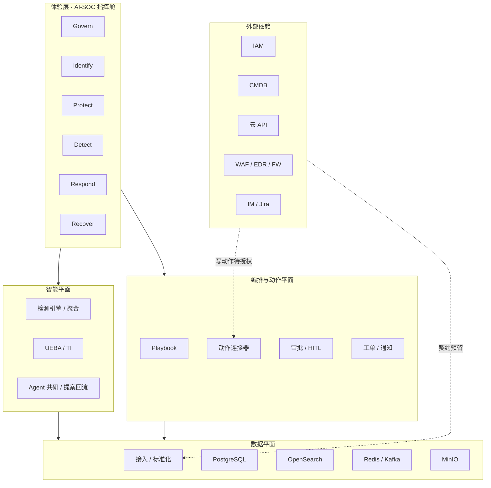
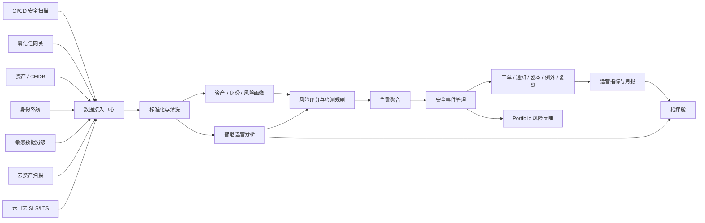
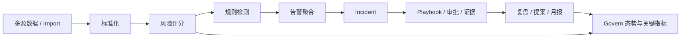
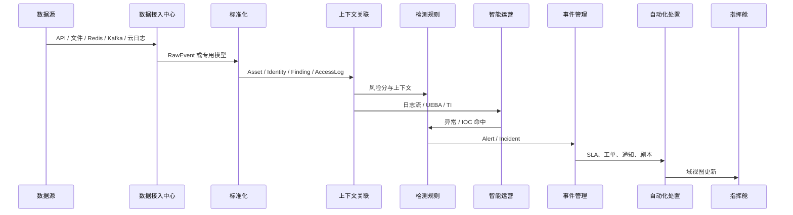
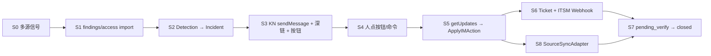

# SOC 安全运营中心系统架构设计

> **文档职责**：系统建设目标、架构原则、分层、模块职责、数据流、安全边界与六域能力边界（设计视角）。  
> **不写**：落地状态 / 排期 / 生产门禁（→ `implementation-roadmap.md`）、技术选型与端口（→ `technology-stack.md`）、页面线框与交互（→ `ui-command-cockpit-prototype.md`）、API 清单（→ `openapi.yaml` / `api-integration-guide.md`）。

## 1. 建设目标

SOC 安全运营中心用于承接公司安全基础设施逐步上线后的统一运营能力。系统将 CI/CD 安全扫描、零信任网关、资产系统、身份系统、敏感数据分级分类、云资产扫描、云厂商日志和人工风险发现统一接入，形成可研判、可分派、可闭环、可汇报的安全运营中枢。

体验层按 **NIST CSF 2.0** 组织为「安全大脑指挥舱」（Govern / Identify / Protect / Detect / Respond / Recover）。IA 见 `ui-command-cockpit-prototype.md`；落地状态见 `implementation-roadmap.md`。

| 目标 | 说明 | CSF 落位 |
|---|---|---|
| 统一数据接入 | API、离线导入、消息队列、日志采集网关、云日志适配器。 | Identify |
| 统一数据模型 | Asset、Identity、Finding、AccessLog、Alert、Incident。 | 数据平面 |
| 风险优先级 | 严重度、资产敏感度、暴露面、身份风险、业务影响、SLA。 | Identify / Detect |
| 检测与事件化 | 规则 DSL、频率、ATT&CK、告警聚合。 | Detect |
| 闭环运营 | 工单、通知、SLA、处置、例外、复盘、月报、项目风险反哺。 | Respond / Recover / Govern |
| 智能运营 | 日志流、长期分析、UEBA、威胁情报、开源 SOAR 适配。 | Detect / Respond |
| 管理看板 | 风险态势、关键指标、事件队列、规则覆盖、组件健康。 | Govern |
| 指挥舱 IA | 六域导航与调查/编排体验。 | 全域 |

## 2. 架构原则

| 原则 | 设计要求 |
|---|---|
| MVP 最小可用 | Docker Compose 本地快速启动，优先核心闭环。 |
| 标准化优先 | 接入数据先转 SOC 标准模型，再检测与处置。 |
| 上下文关联 | 风险绑定资产、业务系统、Owner、国家、环境、敏感等级与身份。 |
| 可扩展接入 | 离线样例 → API 拉取、Redis Stream、Kafka、云日志。 |
| 可审计闭环 | 告警、事件、处置、例外、复盘、月报留痕。 |
| 安全最小化 | 不保存 Token、Cookie、密码、AK/SK、OAuth code、用户四要素明文。 |
| CSF 运营骨架 | Govern→Identify→Protect→Detect→Respond→Recover；技术模块融合嵌入。 |
| AI 可治理 | Agent 建议可解释；高风险动作走 HITL 与 L0–L4 自主等级。 |

## 3. 总体架构

### 3.1 四层底座

| 层 | 职责 | 关键组件 |
|---|---|---|
| 体验层 | CSF 六域指挥舱、域内 Agent 共研、审批台账 | React 前端 |
| 智能平面 | 规则检测、UEBA/TI、Agent 共研、案例回流提案 | DetectionEngine、SmartOps、Agent/Proposals |
| 编排与动作平面 | Playbook、连接器、审批、ITSM/IM | Automation、Approvals、Connectors |
| 数据平面 | 接入、标准化、实体存储、检索与流 | PostgreSQL、OpenSearch、Redis/Kafka、MinIO |



### 3.2 端到端数据流



### 3.3 运行时闭环



### 3.4 系统分层职责

| 层级 | 核心职责 | 指挥舱映射 |
|---|---|---|
| 数据接入层 | RawEvent、资产、身份、Finding、AccessLog；离线与在线连接器 | Identify 可见性 |
| 标准化层 | 清洗、脱敏、类型识别、模型归一、稳定 ID | 数据平面 |
| 上下文层 | 资产/身份画像、业务系统、Owner、敏感与暴露面 | Identify |
| 检测层 | 风险评分、规则 DSL、ATT&CK、聚合与误报反馈 | Detect / Protect 基线 |
| 事件层 | Incident、SLA、处置、例外、工单、通知、Playbook、复盘 | Respond / Recover |
| 智能运营层 | 日志流、长期分析、UEBA、TI、开源 SOAR 适配 | Detect / Respond |
| 展示层 | CSF 六域指挥舱 + 域内能力嵌入 | Govern 等全域 |

## 4. 核心能力模块

| 模块 | 核心职责 | 关键输出 |
|---|---|---|
| 数据接入中心 | API/Webhook、离线、DB 文件、Redis Stream、Kafka、Filebeat/syslog、云日志适配器 | RawEvent、Asset、Identity、Finding、AccessLog |
| 数据标准化中心 | 统一字段、过滤敏感信息 | 标准化实体、接入结果、错误信息 |
| 资产与身份画像 | 汇总资产风险、身份访问、告警与事件关联 | 资产画像、身份画像 |
| 风险评分引擎 | Finding / AccessLog 风险分 | `risk_score`、风险等级 |
| 检测规则引擎 | 条件、频率、聚合窗口、ATT&CK | Alert、规则命中、覆盖矩阵 |
| 告警聚合中心 | 按规则/资产/身份/来源/窗口聚合 | AlertAggregation、`aggregate_key` |
| 事件管理中心 | 严重/高分告警升级为 Incident | Incident、ResponseAction、SLA |
| 自动化处置中心 | 派单、通知、Playbook、例外提醒、月报；KN 六 Bot 出站；IM 回流状态机 | Ticket、Notification、PlaybookExecution、IMAction、MonthlyReport |
| IM 通道与源反哺 | 分路由 sendMessage / getUpdates；S8 `SourceSyncAdapter` | kn_chat_*、source_sync_* |
| 证据管理 | 扫描报告、截图、审计材料 | Evidence object |
| 项目风险反哺 | 高风险事件同步项目风险管理 | PortfolioRisk 队列 |
| 智能运营中心 | 日志流、长期分析、UEBA、TI、开源 SOAR | SmartOps 相关实体 |
| 合规与防御台账 | 合规框架/控制项、防御策略包、DLP、作战室、演练、Memory（设计上属编排/数据平面台账） | 见 OpenAPI 占位组 |

### 4.1 NIST CSF 能力映射（摘要）

业界模块细表（G-M*～C-M*）与 IA 见 `ui-command-cockpit-prototype.md`。摘要：

| CSF 域 | 架构侧能力重心 |
|---|---|
| Govern | Dashboard、KPI、月报、Portfolio、Health、Approvals、策略与 AI 治理 |
| Identify | Asset/Identity/Finding、Data Sources、关系上下文、攻击面信号 |
| Protect | Exceptions、Connectors、基线、防御/DLP 策略台账 |
| Detect | Rules、Aggregations、调查上下文、UEBA/TI、狩猎检索 |
| Respond | Playbooks、Tickets、Notifications、Approvals、证据、War-room；**IM 六 Bot 出站+回流** |
| Recover | Reviews、Proposals、Monthly、Drills、Memory、Portfolio Sync |

## 5. 数据流时序



| 阶段 | 输入 | 输出 |
|---|---|---|
| 采集 | API、日志、文件、消息、云日志 | RawEvent 或专用实体 |
| 清洗 | 原始字段 | 去敏、映射、标准时间、稳定 ID |
| 归一 | RawEvent | Asset、Identity、Finding、AccessLog |
| 关联 | 标准实体 | 画像与业务上下文 |
| 检测 | 风险与访问行为 | Alert、Incident、覆盖 |
| 智能运营 | 标准化日志、IOC、长期留存 | UEBAFinding、ThreatIntelMatch 等 |
| 处置 | Incident | Ticket、Notification、Action、Exception、Review |
| 汇报 | 运营结果 | Dashboard、MonthlyReport、PortfolioRisk |

实体字段契约见 `data-contracts.md`；HTTP 面见 `openapi.yaml`。

## 6. code_audit 接入约定（架构边界）

```text
code_audit Portal
  → assets/import（repo 资产 + owner）
  → findings/import（source=code-audit/{tool}, owner, labels）
  → DetectionEngine
  → Alert.aggregate_key 含 risk_type + source
  → Incident.source / owner / aggregated_count
```

| 约定 | 说明 |
|---|---|
| 数据来源 | Finding.`source` = `code-audit/{tool}`，回填 Incident.`source` |
| 人员 | Finding.`owner` → Incident.`owner`；缺省回退 Asset.`owner` |
| 聚合 | Alert 按 `risk_type` + `source` 区分扫描器噪音 |
| 重复推送 | 可回填 Owner/Source，抬升 `aggregated_count` |

字段细节见 `code_audit_security_baseline/docs/soc-push-guide.md` 与 `data-contracts.md`。演示流程见 `demo-scenarios.md`。

### 6.1 六类 IM 运营闭环（架构分层）

> 运营契约权威：`im-closed-loop-framework.md`。本节只定**分层边界与依赖方向**。

六类 Bot（code_audit / access_risk / data_security / cloud_security / threat_intel / soc_ops）共用同一九阶段机；**只换 S0 信号源与 S8 反哺适配器**。

```text
通道层                核心层                 编排层              适配层
kn_chat 出站     →   ApplyIMAction    →   afterIMAction  →  SourceSyncAdapter
kn_chat_inbound      （Incident 状态机）      ├─ Ticket/ITSM       ├─ code_audit → Portal
（按钮/命令）                              └─ syncSource        ├─ * → Webhook
                                                                  └─ 未配置 → Noop
```

| 层次 | 代码落点 | 允许依赖 | 禁止 |
|---|---|---|---|
| 通道层 | `kn_chat.go`、`kn_chat_inbound.go` | Bot Token、Telegram 兼容 API | 写 Portal URL / 改 Finding 生命周期 |
| 核心层 | `im_actions.go` | Store（Incident/Ticket/Comment） | 引用具体源系统 HTTP |
| 编排层 | `portal_sync.go`（Ticket/ITSM）、`afterIMAction` | `SourceSyncAdapter` 接口 | 按路由 if-else 堆业务 |
| 适配层 | `source_sync.go` | 各自 URL/Token | 互相调用；改 Incident 状态机 |



| CL 切片 | 架构含义 |
|---|---|
| CL-1 | 出站文案附 Incident / UI / API 提示（路由无关骨架 + 按路由 S8 提示） |
| CL-2 | 规范化入站 API `POST /api/v1/soc/im/actions` |
| CL-3/4 | 通道层按钮与命令 → 只调用核心层 |
| CL-5 | Ticket/ITSM 正交；S8 按路由插拔 |

环境变量边界：`KN_CHAT_*`（通道）· `ITSM_WEBHOOK_URL`（工单）· `CODE_AUDIT_PORTAL_*` / `SOURCE_SYNC_WEBHOOK_*`（适配层）。

### 6.2 非业务 CRUD 复用（P0/P1）

| 层 | 落点 | 职责 |
|---|---|---|
| Store | `store_crud.go` | Map `List` / `Get` / `Import` / 过滤 List；业务方法只保留 normalize 与排序 |
| API | `api_crud.go` | `handleListGET`、`handleImportPOST`；副作用用自定义 `respond` |

约束：检测评分、Incident 状态机、IM/源同步**不**进入 CRUD 工厂。

## 7. 安全边界

当前默认面向本地与内部 demo。共享/生产环境加固要求见 `security-and-permissions.md`；上线门禁见 `implementation-roadmap.md` §9.4。

架构层硬约束：

| 风险点 | 设计要求 |
|---|---|
| API 未鉴权 | SSO / 反向代理 / API Token |
| CORS 过宽 | 仅可信域名 |
| 默认密码 | `.env` 或密钥管理 |
| 检索/对象存储裸奔 | 认证或仅内网 |
| 原始日志敏感信息 | 接入前脱敏，禁止入库明文密钥与四要素 |

## 8. 六域服务模块（设计边界）

> 落地「有 / 有（占位）」状态见 `implementation-roadmap.md` §8。本节只描述**目标能力与依赖边界**。

### 8.1 Govern · 战略指挥舱

将业务目标转化为安全策略，对齐风险与业务。能力重心：态势大屏、策略即代码（合规框架→可执行控制）、供应链风险可见性。依赖：统一 IAM、CMDB、风险偏好。数据：CMDB、合规扫描、CTI、BIA、Asset/Finding Import、TI、Portfolio。

### 8.2 Identify · 全域资产图谱

从静态台账升级为动态业务拓扑。能力重心：业务拓扑、暴露面 ASM、漏洞与配置核查。依赖：资产发现探针、扫描网络策略。数据：云 API、AD/LDAP、端点清单、主动扫描、Import 契约。

### 8.3 Protect · 自适应防御中枢

统一管控防御设施与数据保护策略。能力重心：WAF/FW/EDR 策略编排、零信任访问控制、DLP。依赖：设备写 API、终端 Agent、数据分级标准。数据：WAF/IPS、EDR、DLP、IAM 鉴权日志。

### 8.4 Detect · AI 智能分析引擎

降噪、关联、还原攻击链。能力重心：告警聚合、调查上下文、威胁狩猎检索。依赖：统一日志格式、检索索引、TI。数据：全流量/终端/身份/应用日志、外部 TI。

### 8.5 Respond · 自动化编排与处置

SOAR 自动化与人机协同。能力重心：Playbook 编排、动作工具箱、作战室协同、**KN 六 Bot 告警出站与 IM 回流**。依赖：设备写权限、响应授权流程、IM Bot Token。数据：告警事件、资产归属、工单、IM 动作台账（`IMAction`）、源系统回写结果。

设计约束：IM 通道不得直接改源系统；须经 `ApplyIMAction` → `SourceSyncAdapter`。
### 8.6 Recover · 韧性与进化

业务恢复与经验沉淀。能力重心：灾备演练（RTO/RPO）、AI Memory、复盘报告。依赖：备份与容灾、知识库。数据：备份日志、处置全过程、恢复日志、Reviews。

## 9. 后续扩展方向（架构视角）

| 方向 | 建议 |
|---|---|
| 真实 ITSM / IM | Jira、ServiceNow；KN 生产告警群（CL-6）；飞书/Teams 可作第二通道 |
| 源反哺扩展 | 为 access/data/cloud/TI 配置 `SOURCE_SYNC_WEBHOOK_*` 或专用 Adapter |
| 开源 SOAR | Shuffle、TheHive/Cortex 与轻量 Playbook 适配 |
| UEBA | 零信任与身份日志稳定后做行为基线 |
| 威胁情报 | MISP 或商业 TI |
| 日志湖 | Kafka/Flink/ClickHouse/S3 Data Lake |
| 指挥舱深化 | 真联动 / SSO / 真数据源；IM 动作台账 UI（排期见路线图） |

排期与前置统一见 `implementation-roadmap.md`。
