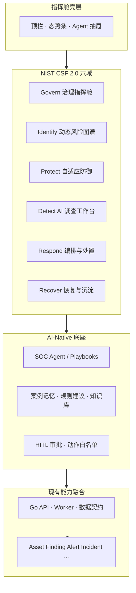

# SOC 安全大脑指挥舱 — 管理界面设计原型

> 状态：**UI / IA 设计原型 v0.9.0**  
> 框架依据：NIST CSF 2.0 六大核心功能  
> 产品定位：将传统「告警控制台」升级为 **AI-Native 安全大脑指挥舱（Security Brain Command Cockpit）**  
> 原则：现有 SOC MVP 能力**融合嵌入**，不推倒重来；按 CSF 重组导航与信息架构。  
> **本文只谈界面与信息架构**；排期、落地状态、后端实现见 `implementation-roadmap.md`。

---

## 1. 文档目的与读者

| 项 | 说明 |
|---|---|
| 目的 | 定义指挥舱信息架构、六域页面原型、交互范式、线框清单与产品验收口径。 |
| 读者 | 安全负责人、SOC 产品、前端研发、体验评审。 |
| 非目标 | **不写**实施排期、生产门禁、后端 API/服务落地状态（一律见 `implementation-roadmap.md`）；不替代 `architecture.md` / `data-contracts.md` 的技术契约。 |
| 姊妹文档 | `architecture.md`（系统架构）· `implementation-roadmap.md`（UI+后端融合实现路径） |

相关文档：

- `docs/architecture.md` — 系统架构与数据流
- `docs/implementation-roadmap.md` — **唯一**实现路径（UI 分期 + 后端能力 + 前置/门禁）
- `docs/feature-guide.md` — 当前页面与能力说明
- `docs/data-contracts.md` — 数据模型
- `docs/agent-playbooks.md` — Agent 剧本
- `docs/industry-benchmark-gap-analysis.md` — 业界差距

---

## 2. 产品定位

### 2.1 一句话

**安全大脑指挥舱**以 NIST CSF 2.0 为运营骨架，以 AI Agent 为研判与编排协作者，把「看告警」升级为「治理目标 → 识别风险 → 保护基线 → 智能检测 → 自主响应 → 恢复沉淀」的连续指挥闭环。

### 2.2 对比升级

| 维度 | 传统告警控制台 | 安全大脑指挥舱 |
|---|---|---|
| 组织方式 | 按技术模块（接入/规则/告警/工单） | 按 CSF 运营职能（GV/ID/PR/DE/RS/RC） |
| 分析师动作 | 翻列表、点开告警、人工拼上下文 | 在调查工作台与 Agent 共研，一次任务贯穿证据链 |
| 管理层视角 | KPI 卡片散落 | Govern 指挥舱：业务目标 ↔ 策略 ↔ 态势 |
| 资产视角 | 静态台账表 | Identify 动态风险图谱（业务上下文） |
| 处置视角 | 点按钮跑剧本 | Respond 编排中心：辅助决策 → 受控自主执行 |
| 学习视角 | 复盘文档外挂 | Recover 知识沉淀回流规则/策略/Agent |

### 2.3 设计原则

1. **CSF 导航优先**：一级导航固定六大功能；技术能力作为二级「能力嵌入」。
2. **现有能力复用**：Dashboard、Details、Ingestion、Detection、Automation、SmartOps、Health、Portfolio **映射嵌入**，不重复造轮子。
3. **AI-Native 默认**：每个功能域提供「人机共驾」工作面（建议、证据、可执行动作、审批边界）。
4. **角色可裁剪**：同一壳层，管理层默认进 Govern；分析师默认进 Detect；工程师默认进 Protect/Respond。
5. **可追溯**：任意 AI 建议与自主动作必须可下钻到 Finding/Alert/Incident/证据与审批记录。

---

## 3. 总体信息架构

### 3.1 一级导航（CSF 六域）

```text
┌──────────────────────────────────────────────────────────────────────┐
│  SOC 安全大脑指挥舱                          [Agent] [审批] [健康]   │
├──────────┬──────────┬──────────┬──────────┬──────────┬──────────────┤
│ Govern   │ Identify │ Protect  │ Detect   │ Respond  │ Recover      │
│ 治理指挥 │ 识别图谱 │ 保护基线 │ 调查台   │ 编排处置 │ 恢复沉淀     │
└──────────┴──────────┴──────────┴──────────┴──────────┴──────────────┘
```

### 3.2 全局壳层（所有页面常驻）

| 区域 | 内容 |
|---|---|
| 顶栏 | 环境、租户/组织、时间窗、全局搜索（资产/身份/事件/规则）、Agent 唤起、待审批数、组件健康灯 |
| 态势条 | 开放 Critical 事件、超 SLA、今日新增高危 Finding、自动处置成功率、Agent 建议待确认 |
| 右侧抽屉（可选） | Agent 会话 / 证据篮 / 快捷动作；不打断主工作流 |
| 底栏 | 数据新鲜度、最近检测运行、最近数据源运行 |

### 3.3 现有模块 → CSF 映射总表

| 现有模块 / 能力 | 主要嵌入域 | 次要出现 |
|---|---|---|
| Dashboard（态势/KPI/角色视角） | **Govern** | Detect 摘要 |
| Portfolio Risks / 月报 / 运营指标 | **Govern** | Recover |
| Assets / Identities / Findings / AccessLogs | **Identify** | Detect 上下文 |
| Data Sources / Ingestion | Identify（可见性） | Protect（数据面防护） |
| 规则 DSL / 发布 / dry-run / ATT&CK / 误报 | **Detect** | Protect（基线策略） |
| 告警聚合 / 风险趋势 | **Detect** | Govern |
| 零信任动作连接器 / 策略类动作 | **Protect** | Respond |
| Playbooks / Tickets / Notifications / Approvals | **Respond** | Recover |
| Incidents / SLA / 调查台 / Evidence | **Detect** + **Respond** | Recover |
| SmartOps（UEBA / TI / 日志流 / SOAR） | **Detect** + **Respond** | Identify |
| Components Health | Govern（平台治理） | Protect |
| code_audit 来源/owner/聚合 | Identify + Detect | Respond |

### 3.4 架构示意



---

## 4. AI-Native 技术底座（跨域）

指挥舱不是单独做一个「聊天页」，而是把 AI 能力嵌进六域工作流。

| 能力层 | 界面表现 | 现有可复用 |
|---|---|---|
| 感知 | 自动摘要态势、异常热点、重复聚合簇 | Dashboard、Aggregations、Risk Trends |
| 推理 | 调查假设、ATT&CK 路径、相似历史案例 | Agent Playbooks、规则 dry-run、UEBA/TI |
| 行动 | 建议 Playbook 步骤、生成工单正文、预填处置参数 | Playbooks、SOAR Connectors、Tickets |
| 治理 | 高风险动作强制审批、范围限制、审计回放 | Approvals、HITL 文档、Audit Trail |
| 记忆 | 复盘结论回流规则建议与调查模板 | Reviews、Monthly Reports、Rule Feedback |

### 4.1 Agent 工作面统一交互

每个 CSF 域右上角提供一致入口：

| 控件 | 行为 |
|---|---|
| `Ask Agent` | 带当前页面上下文包（见 `context-map.md`）发起任务 |
| `Suggest Next` | 基于当前对象给出 1–3 条可执行下一步 |
| `Explain` | 用非技术语言解释风险分、为何升级事件、为何推荐动作 |
| `Draft` | 生成通知/工单/复盘草稿，人工确认后提交 |

禁止事项：Agent 不得绕过审批执行封禁/撤销会话等高风险动作（见 `human-in-the-loop.md`）。

---

## 5. Govern（治理）— 全局指挥舱与安全策略中心

### 5.1 定位

将管理层业务目标转化为可执行安全策略，并持续度量「策略是否落地、风险是否收敛」。

### 5.2 目标用户

CISO / 安全负责人 / 运营经理 / 合规对接人。

### 5.3 页面原型：指挥舱首页（默认落地页·管理层）

```text
┌─ Govern · 全局指挥舱 ─────────────────────────────────────────────┐
│ 业务目标条：[资金安全] [核心支付] [代码供应链]     时间窗：30d     │
├───────────────┬───────────────────────────┬───────────────────────┤
│ 目标→策略映射 │ 态势雷达（CSF 六域健康）   │ 决策队列               │
│ · 代码高危清零│  GV ● ID ● PR ● DE ● RS ● │ · 待批例外 3            │
│ · 超SLA < 5%  │  RC ●                      │ · 待批封禁 1            │
│ · Owner绑定≥95│                           │ · Agent建议 7           │
├───────────────┴───────────────────────────┴───────────────────────┤
│ KPI 行：Critical事件 | 闭环率 | Owner绑定 | 重复风险↓ | Portfolio反哺 │
├──────────────────────────────────────────────────────────────────┤
│ 重点业务风险热力（按 business_system） | 本月策略变更审计           │
└──────────────────────────────────────────────────────────────────┘
```

### 5.4 子模块

| 子模块 | 功能原型 | 融合现有能力 |
|---|---|---|
| G1 指挥态势 | CSF 六域健康度、Critical/High、超 SLA、闭环率 | Dashboard、SLA、Analytics |
| G2 策略中心 | 安全策略目录：检测启停策略、推送策略、例外策略、SLA 策略 | Rules 启停、Exceptions、env 配置抽象为策略对象 |
| G3 目标管理 | 业务目标卡 → 关联资产范围 / 规则集 / KPI | Portfolio Risks、业务系统字段 |
| G4 合规与治理 | RBAC/审批策略、数据保留、Agent 权限开关（设计态） | security-and-permissions、Approvals |
| G5 平台治理 | 组件健康、数据源健康、推送失败 | Components Health、Data Source Runs |
| G6 管理层汇报 | 一键生成月报摘要、导出给 Protfolio | Monthly Reports、Portfolio Sync |

### 5.5 关键交互

1. 选择业务目标「资金相关仓库高危清零」。
2. 系统自动关联 Identify 中 `business_system`/code_audit 项目与 Detect 规则集。
3. 展示缺口：未绑定 Owner、未覆盖规则、超 SLA 事件。
4. Agent 生成「本周治理建议」；人工确认后进入 Protect/Detect 执行项。

### 5.6 验收口径（原型）

- 管理层 30 秒内看到：总体风险、六域健康、待决策事项。
- 任意 KPI 可下钻到事件/资产，不丢上下文。
- 策略变更有审计入口（即便后端先用现有审批/规则版本近似）。

---

## 6. Identify（识别）— 动态资产与风险图谱

### 6.1 定位

从静态资产台账升级为**带业务上下文的动态风险地图**：谁拥有、暴露面如何、代码/身份/访问风险如何叠加。

### 6.2 目标用户

资产管理员、安全工程师、业务 Owner、分析师（调查入口）。

### 6.3 页面原型：风险图谱

```text
┌─ Identify · 动态风险图谱 ─────────────────────────────────────────┐
│ 视图切换：(图谱) (资产表) (身份表) (仓库/代码仓) (暴露面)           │
├──────────────────────────────┬────────────────────────────────────┤
│         图谱画布              │ 选中节点详情                        │
│  [业务系统]──[应用资产]       │ 名称 / Owner / 敏感级 / 暴露级      │
│       │         │             │ 开放 Finding · Alert · Incident    │
│  [身份簇]    [代码仓]         │ 来源：code-audit/trivy …            │
│       └──访问异常──┘          │ [打开调查] [绑定Owner] [看血缘]     │
├──────────────────────────────┴────────────────────────────────────┤
│ 风险叠加条：CVE/Secret | 异常访问 | UEBA | 威胁情报命中              │
└───────────────────────────────────────────────────────────────────┘
```

### 6.4 子模块

| 子模块 | 功能原型 | 融合现有能力 |
|---|---|---|
| I1 资产图谱 | 业务系统–资产–身份–仓库关系可视化（P0 可用表+关系卡，P1 真图谱） | Assets、Identities、Asset Profile |
| I2 代码资产视图 | 按 `repo-*` / project_key 看 Finding、owner、聚合 | code_audit 推送结果、Findings 明细 |
| I3 风险发现台账 | 按来源/类型/负责人/状态筛选；支持聚合标签；**IM 关闭/误报后状态回看** | Findings Detail · `#/identify-findings` |
| I4 访问与暴露 | 异常访问、公网暴露类 Finding | AccessLogs、public_exposure |
| I5 数据源可见性 | 「我们看见了什么」：数据源覆盖与新鲜度 | Data Sources、Runs、Checkpoints |
| I6 Owner 治理 | 高风险无 Owner 清单、一键跳转补齐 | Asset.owner、Finding.owner |

### 6.5 关键交互

1. 从 Govern 热力点击「资金」业务系统。
2. Identify 打开该系统子图：核心 API、关联仓库、高权身份。
3. 选中仓库节点 → 看到 `code-audit/trivy` Critical Finding 与负责人。
4. 「打开调查」跳转 Detect，自动带上资产/Finding 上下文包。

### 6.6 验收口径（原型）

- 任意资产可看到：Owner、敏感级、开放高危、关联事件。
- code_audit 资产可区分 `source` 与聚合信息。
- 「无 Owner 高风险」清单可导出/分派。

---

## 7. Protect（保护）— 自适应防御与基线管理

### 7.1 定位

管理防御策略下发与有效性监控：零信任策略动作、检测基线、例外边界、防护覆盖度。

### 7.2 目标用户

安全工程师、平台运维、零信任管理员。

### 7.3 页面原型：防御控制面

```text
┌─ Protect · 自适应防御 ────────────────────────────────────────────┐
│ 防御覆盖仪表：ZT策略 | 检测基线启用率 | 例外到期 | 动作连接器健康   │
├────────────────────┬────────────────────┬─────────────────────────┤
│ 基线策略包          │ 防御动作目录         │ 有效性监测               │
│ · 代码高危必检出    │ · 撤销会话           │ · 应挡未挡样本            │
│ · 核心资产必有Owner │ · 封禁源IP           │ · 误伤率 / 审批耗时       │
│ · Secret默认阻断    │ · MFA升级            │ · 连接器最近执行          │
├────────────────────┴────────────────────┴─────────────────────────┤
│ 例外与白名单（到期提醒） | 变更草稿 + Agent 影响面评估               │
└───────────────────────────────────────────────────────────────────┘
```

### 7.4 子模块

| 子模块 | 功能原型 | 融合现有能力 |
|---|---|---|
| P1 基线策略包 | 将规则集/SLA/推送策略打包为「防护基线」版本 | Detection Rules、Govern 策略对象 |
| P2 防御动作目录 | 可下发动作清单与权限要求 | SOAR Action Connectors |
| P3 例外管理 | 例外申请、到期、复审 | Exceptions |
| P4 有效性监测 | 防护是否生效（以误报/漏报/动作成功率为代理指标） | Rule Feedback、Automation 执行历史 |
| P5 组件与连接器健康 | 防御链路依赖 | Components Health、SOAR Sync |

### 7.5 关键交互

1. 工程师调整「核心资产检测基线」启用一组规则。
2. Agent 给出 dry-run 影响面（预计新增告警数）。
3. 审批后发布；Protect 显示基线版本与覆盖变化。
4. 例外到期自动出现在 Govern 决策队列。

### 7.6 验收口径（原型）

- 基线变更可预览影响（复用 dry-run）。
- 高风险防御动作必须显示审批要求。
- 例外到期进入指挥舱待办。

---

## 8. Detect（检测）— AI 智能体调查工作台

### 8.1 定位

分析师**日常主战场**。彻底改变「看告警列表」模式：以**调查任务（Investigation）**为中心，告警/事件/证据/Agent 假设在同一工作台合流。

### 8.2 目标用户

SOC 分析师（主）、安全工程师（辅）。

### 8.3 页面原型：调查工作台（默认落地页·分析师）

```text
┌─ Detect · AI 调查工作台 ──────────────────────────────────────────┐
│ 队列：需要我的 | 高危聚合簇 | Agent已初筛 | 待人工确认              │
├──────────┬───────────────────────────────────┬────────────────────┤
│ 队列列表  │ 调查画布（当前任务）                │ Agent 共研面板      │
│ Alert簇  │ 时间线 · 实体关系 · 证据附件         │ · 假设：凭证泄露传播 │
│ Incident │ Finding/AccessLog/UEBA/TI 标签页    │ · 相似案例 2         │
│          │ ATT&CK 映射高亮                     │ · 建议下一步 3       │
│          │ [升级事件] [误报] [请求处置]         │ · 一键生成调查笔记   │
└──────────┴───────────────────────────────────┴────────────────────┘
```

### 8.4 子模块

| 子模块 | 功能原型 | 融合现有能力 |
|---|---|---|
| D1 调查队列 | 按优先级/Owner/SLA/聚合簇排列，而非纯告警流水 | Alerts、Aggregations、Incidents |
| D2 调查画布 | 单任务多实体上下文 + 时间线 | Incident 调查台、Comments、Tasks、Timeline |
| D3 检测工程 | 规则列表、版本、dry-run、测试用例、发布 | Detection Panel |
| D4 信号雷达 | UEBA、威胁情报命中、风险趋势 | SmartOps、Risk Trends、ATT&CK Coverage |
| D5 反馈闭环 | 误报/真阳性反馈回写规则 | Feedback API |
| D6 Agent 共研 | 假设、证据提问、草稿结论 | Agent Playbooks（风险导入研判等） |

### 8.5 交互范式变化

| 旧模式 | 新模式 |
|---|---|
| 打开告警 → 另开资产页 → 再开日志 | 队列进入调查任务，上下文自动装配 |
| 人工写结论 | Agent 草稿 + 人工修订 |
| 告警风暴 | 先看聚合簇与 `aggregated_count`，再下钻 |
| 不知道下一步 | `Suggest Next`：升级 / 误报 / 请求 Respond 剧本 |

### 8.6 与 code_audit 的体验

- 队列筛选：`source starts with code-audit/`
- 调查画布展示：工具来源、仓库 Owner、聚合标签、影响文件摘要（来自 labels/description）
- 一键「回到 Portal 研判」深链（设计预留）

### 8.7 验收口径（原型）

- 分析师主路径不离开 Detect 即可完成：看簇 → 查证据 → 反馈 → 请求处置。
- Agent 建议必须展示依据（规则/情报/相似案例 ID）。
- 高危动作仅生成「请求」，跳转 Respond，不直接执行。

---

## 9. Respond（响应）— 自动化编排与处置中心

### 9.1 定位

从「辅助决策」迈向「受控自主执行」：Playbook、工单、通知、连接器动作、审批与执行台账一体化。

### 9.2 目标用户

SOC 值班长、自动化工程师、分析师（执行确认）。

### 9.3 页面原型：编排处置中心

```text
┌─ Respond · 编排与处置中心 ────────────────────────────────────────┐
│ 模式：辅助建议 | 半自动（逐步确认） | 自动（白名单剧本）            │
├─────────────────┬──────────────────────┬──────────────────────────┤
│ 待处置队列       │ 剧本运行器             │ 执行与审批               │
│ Incident 列表   │ 步骤图：通知→工单→动作 │ 审批单 · 范围 · 回滚点   │
│ SLA 倒计时      │ 当前步参数预览         │ 连接器状态               │
├─────────────────┴──────────────────────┴──────────────────────────┤
│ 执行时间线（Ticket / Notification / SOAR Action / Approval）       │
└───────────────────────────────────────────────────────────────────┘
```

### 9.4 子模块

| 子模块 | 功能原型 | 融合现有能力 |
|---|---|---|
| R1 处置队列 | Incident 按 SLA/严重度；来源与 Owner 可见 | Incidents、SLA |
| R2 剧本编排 | Playbook 定义、试跑、绑定触发条件 | Playbooks |
| R3 半自动执行 | 逐步确认参数后执行 | Playbook Run、Action Connectors |
| R4 自主执行舱 | 仅白名单低风险步骤可自动；高风险进审批 | Approvals、HITL |
| R5 协同通道 | 工单/通知台账与 Webhook；**IM 六 Bot 出站与回流** | Tickets、Notifications、`im/actions` |
| R6 外部 SOAR | Shuffle/TheHive 适配状态与同步 | SmartOps SOAR |

### 9.5 自主等级（产品定义）

| 等级 | 含义 | 示例 |
|---|---|---|
| L0 人工 | 只给建议 | Agent 建议封禁 IP |
| L1 辅助 | 预填参数，人点执行 | 生成工单正文 |
| L2 半自动 | 多步剧本逐步确认 | 通知 Owner → 创建工单 |
| L3 受控自动 | 白名单剧本自动跑 | 例外到期提醒、月报生成 |
| L4 高自治自动 | 默认关闭，需策略+双人审批 | 生产封禁 / 会话撤销 |

### 9.6 验收口径（原型）

- 从 Detect「请求处置」可带着 Incident 上下文进入 Respond。
- 高风险动作强制显示审批态与执行范围。
- 每次执行可审计回放。

### 9.7 IM 闭环处置（原型交互 · 六 Bot 共用）

> 运营契约见 `im-closed-loop-framework.md`；本小节**指挥舱里去哪看状态**。

#### 出站体验（IM）

告警消息包含：路由标题、Incident ID、证据摘要、**Inline 按钮**（认领 / 建单 / 误报 / 已修复 / 关闭 / 升级）、SOC 深链提示。六 Bot 文案结构一致，仅路由与 `@bot` 不同。

#### 指挥舱回看路径

| 看什么 | 导航 / Hash | 用户动作 |
|---|---|---|
| Incident 状态 / Owner / 时间线 | **Detect → 调查台** `#/detect` | 点开对应 Incident |
| 工单状态 / sync | **Respond → 编排处置** `#/respond-ops` | Tickets 台账 |
| Finding 生命周期 | **Identify → 风险台账** `#/identify-findings` | 按 `code-audit/*` / project 筛选 |
| 通知是否发出 | Respond 通知台账 / API `notifications` | `im_sent:{route}` |
| IM 动作流水 | API `GET /api/v1/soc/im/actions?incident_id=` | UI 专页为后续增强（当前 API 可审计） |

#### 状态对照（IM 按钮 → 台账）

| IM 动作 | Incident | Ticket | Finding（code_audit） |
|---|---|---|---|
| 认领 ack | acknowledged | in_progress | — |
| 建单 ticket | in_progress | open→in_progress | — |
| 误报 fp | false_positive | cancelled | false_positive |
| 已修复 resolve | pending_verify | resolved | fixed |
| 关闭 close | closed | closed | verified |

#### 验收口径（原型）

1. 用户在 IM 点按钮后，Detect 调查台同一 `incident_id` 状态可见更新（刷新后）。  
2. Identify 风险台账在关闭/误报后可见 Finding 状态变化（code_audit）。  
3. 深链打开 `#/detect` 后，分析师能用 Incident ID 定位事件。

---

## 10. Recover（恢复）— 业务连续性与知识沉淀

### 10.1 定位

攻击/故障后快速恢复业务，并把经验转化为组织能力：复盘、知识库、规则/基线回流、演练。

### 10.2 目标用户

安全负责人、业务连续性负责人、分析师（写复盘）。

### 10.3 页面原型：恢复与沉淀

```text
┌─ Recover · 恢复与知识沉淀 ────────────────────────────────────────┐
│ 恢复看板：受影响业务系统 | 恢复进度 | 未关闭事件 | 演练计划         │
├──────────────────────┬───────────────────────────────────────────┤
│ 事件复盘工作区        │ 知识沉淀                                    │
│ 时间线回放            │ · 案例库（可检索）                           │
│ 根因 / 影响 / 动作    │ · 规则优化建议（来自误报与复盘）             │
│ 遗留项 → 回 Govern   │ · 调查模板 / Agent Prompt 片段               │
├──────────────────────┴───────────────────────────────────────────┤
│ 月报与 Portfolio 反哺 | 桌面演练记录（设计预留）                     │
└───────────────────────────────────────────────────────────────────┘
```

### 10.4 子模块

| 子模块 | 功能原型 | 融合现有能力 |
|---|---|---|
| C1 恢复看板 | 按业务系统看未恢复风险与责任人 | Incidents、Assets、Portfolio |
| C2 复盘中心 | 结构化复盘、证据引用、遗留项 | Reviews |
| C3 知识库 | 案例检索、相似案件推荐给 Detect | Reviews + Agent Memory（设计） |
| C4 能力回流 | 复盘 → 规则/基线/剧本变更提案 | Rule versions、Playbooks、Govern 决策队列 |
| C5 汇报出口 | 月报、管理摘要、Protfolio 同步 | Monthly Reports、Portfolio Sync |

### 10.5 验收口径（原型）

- 关闭事件必须能进入复盘或标记「跳过原因」。
- 复盘遗留项可变成 Govern 待办或 Protect 基线变更。
- 知识条目可被 Detect Agent「相似案例」引用（接口可后置）。

---

## 11. 角色默认落地与权限裁剪

| 角色 | 默认首页 | 可见域 | 主要动作 |
|---|---|---|---|
| 管理层 | Govern | GV 全开；其余只读摘要 | 看态势、批策略、看汇报 |
| SOC 分析师 | Detect | DE/RS 为主；ID 只读 | 调查、反馈、请求处置 |
| 安全工程师 | Protect 或 Detect·工程 | PR/DE 工程/ID | 基线、规则、数据源 |
| 值班长 | Respond | RS/DE | 审批、执行剧本、盯 SLA |
| 业务 Owner | Identify（我的资产） | ID/RS 只读+工单 | 认领风险、看修复 |
| Agent 服务账号 | API | 按工具白名单 | Playbook 只读/建议级 |

---

## 12. 导航与路由建议（信息架构）

| 路由（建议） | 页面 |
|---|---|
| /govern | 指挥舱首页 |
| /govern/policies | 策略中心 |
| /identify | 风险图谱 |
| /identify/assets | 资产/身份表 |
| /protect | 防御控制面 |
| /detect | 调查工作台 |
| /detect/rules | 检测工程 |
| /respond | 编排处置 |
| /recover | 恢复与沉淀 |
| /system/health | 平台健康（也可挂 Govern） |

当前前端以 CSF 顶栏 + 域内场景 ID 承载上述 IA；场景 ID 见下表。路由化可按体验需要渐进，**排期见路线图**。

### 12.1 前端场景 ID（IA 落位）

| 域 | 场景 ID | 场景标题 |
|---|---|---|
| Govern | govern-situ / govern-policy / govern-metrics | 态势与决策 · 策略与 AI 治理 · 度量与平台健康 |
| Identify | identify-risk / identify-identity / identify-surface | 风险与代码仓 · 身份与关系 · 攻击面与数据源 |
| Protect | protect-baseline / protect-defense | 基线与有效性 · 例外与防御 |
| Detect | detect-workbench / detect-hunt / detect-engineering / detect-smartops | 调查台 · 狩猎与信号 · 检测工程 · 智能运营 |
| Respond | 
espond-ops / 
espond-collab | 处置与审批 · 协同与集成 |
| Recover | 
ecover-review / 
ecover-drill | 复盘回流 · 恢复演练 |

---

## 13. 线框级页面清单（设计交付物）

| ID | 页面 | 设计优先级 |
|---|---|---|
| W-GV-01 | Govern 指挥舱首页 | P0 |
| W-GV-02 | 策略中心 | P0 |
| W-ID-01 | 风险图谱/关系卡 | P0 |
| W-ID-02 | 代码仓风险视图 | P0 |
| W-PR-01 | 防御控制面 | P1 |
| W-DE-01 | AI 调查工作台 | P0 |
| W-DE-02 | 检测工程（规则） | P0 |
| W-RS-01 | 编排处置中心 | P0 |
| W-RC-01 | 恢复与复盘 | P1 |
| W-SH-01 | 全局 Agent 抽屉 + 审批铃铛 | P0 |

落地状态与分期见 implementation-roadmap.md（UI 轨）。

---

## 14. 成功标准（产品 / 体验）

1. **范式切换可感知**：分析师主路径以调查任务而非告警行开始。
2. **CSF 可讲解**：对外可用六域讲清 SOC 能力，而不是「我们有很多面板」。
3. **能力不回退**：现有接入、检测、事件、自动化、SmartOps 均可在对应域找到并操作。
4. **AI 可治理**：建议有依据，动作有审批，结果有审计。
5. **上下游可闭环**：Govern 目标可落到 Identify 资产与 Detect/Respond 执行，Recover 可回流。

---

## 15. 评审问题（请业务拍板）

1. 分析师默认首页是否定为 Detect（建议是）？管理层是否强制 Govern？
2. Respond 自主等级：MVP 是否只开放到 L2，L3 仅通知/月报类？
3. Identify 图谱：P0 用「关系卡片+表」是否可接受，真图谱放后续？
4. Agent 是否必须登录后可用，写动作是否统一走审批台账？
5. 与 code_audit Portal、Protfolio 的深链优先级？

---

## 16. 修订记录

| 日期 | 版本 | 说明 |
|---|---|---|
| 2026-07-17 | v0.9.0 | **职责聚焦**：仅保留 UI/IA；实现路径/状态抽离至 `implementation-roadmap.md` |
| 2026-07-17 | v0.8.2 | 修复文档乱码；实现状态曾在 §18（已迁出） |
| 2026-07-17 | v0.1 | 首版设计原型：NIST CSF 2.0 六域指挥舱 + 现有能力映射 + AI-Native 底座 |
